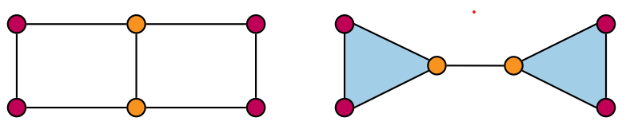
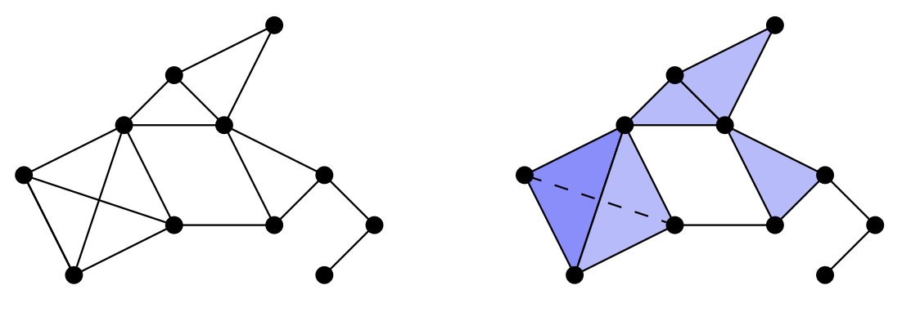
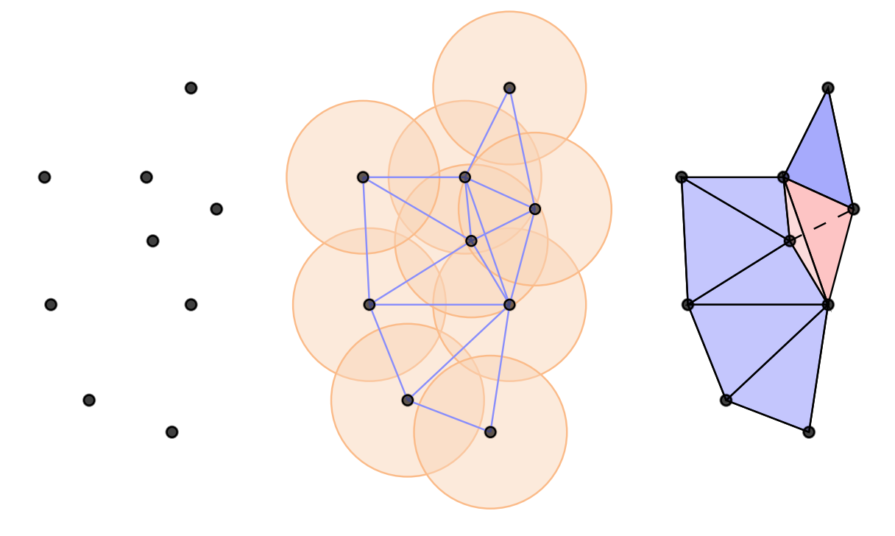
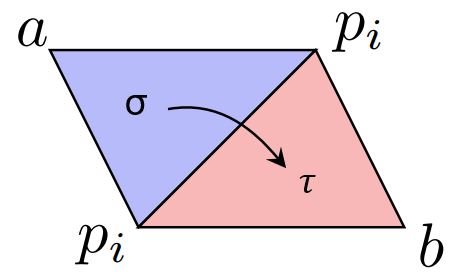
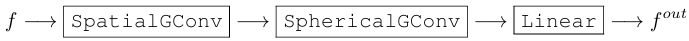
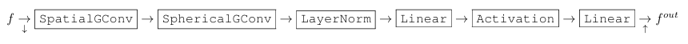
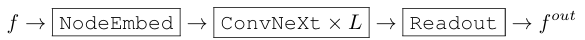
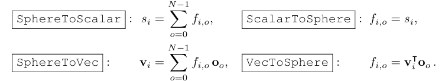

# Fast SE(n) Equivariant Simplicial Message Passing Networks (<span style="color:red;font-weight:bold;background-color:yellow">TODO</span>)

## 1. Introduction <!-- Vincent -->

Traditional approaches in Graph Neural Networks (GNNs), such as Message Passing Neural Networks (MPNNs), are restricted in their expressiveness as they only allow information flow between immediate neighbors. Recent developments have introduced higher-dimensional simplices (Eijkelboom et al., 2023) and geometric data integrations (Bekkers et al., 2023), increasing expressivity but at a significant computational cost. Our proposed model aims to synergize Eijkelboom et al. (2023)'s simplicial, E(n)-equivariant message passing framework with Bekkers et al. (2023)'s group convolutional methods to enhance computational efficiency without compromising expressivity.

The objective of our research is to construct an $E(n)$ equivariant message passing simplicial networks (EMPSN) that maintains high expressivity while significantly reducing computational demands. This approach is anticipated to mitigate the complexity-related challenges present in current models and enable faster, more scalable GNNs suitable for complex datasets. The significance of our work is its potential to improve the efficiency of GNNs, thus facilitating their broader application. We expect that our findings will not only demonstrate enhanced performance and reduced computational load compared to existing models but also provide insights into the integration of complex topological structures in neural networks.

### 1.1 Message Passing Neural Networks

MPNNs are a class of GNNs that operate by iteratively updating node features based on information from neighboring nodes (Gilmer et al., 2017). The message passing framework is defined by a series of functions that update node features based on the features of neighboring nodes. Let $\mathcal{G} = (\mathcal{V}, \mathcal{E})$ be a graph with nodes $\mathcal{V}$ and edges $\mathcal{E}$. Each node $`v_i \in \mathcal{V}`$ and edge $`e_{ij} \in \mathcal{E}`$ has associated feature vectors $`\mathbf{f}_i`$ and $`\mathbf{a}_{ij}`$, respectively. The message passing framework consists three steps. First, the messages $`\mathbf{m}_{ij}`$ from a central node $`v_j`$ to all neighbouring nodes $`v_i`$ are computed:

```math
\mathbf{m}_{ij} = \phi_m(\mathbf{f}_i, \mathbf{f}_j, \mathbf{a}_{ij})
```

where $`\phi_m`$ is a multi-layer perceptron (MLP). Second, the messages are aggregated to update the node features:

```math
\mathbf{m}_i = \sum_{j \in \mathcal{N}(i)} \mathbf{m}_{ij}
```

where $\mathcal{N}(i)$ is the set of neighboring nodes of $`v_i`$. Finally, the node features are updated:

```math
\mathbf{f}_i' = \phi_f(\mathbf{f}_i, \mathbf{m}_i)
```

where $`\phi_f`$ is another MLP.

Although MPNNs have been successful in various applications, they are limited in their expressivity. Due to their local nature, MPNNs can only capture information from immediate neighbors, which limits their ability to capture complex topological structures in the data. In fact, it has been shown that MPNNs are isomorphic to the Weisfeiler-Lehman graph isomorphism test, and that MPNNs can be considered as a 1-dimensional Weisfeiler-Lehman (1-WL) graph isomorphism test (Xu et al., 2018). This means that MPNNs are limited in capturing higher-dimensional topological structures in the data. Figure 1 illustrates an example where two graphs with different topological structures would yield the same result by 1-WL.

<table align="center">
    <tr align="center">
        <td></td>
    </tr>
    <tr align="left">
    <td colspan=2><b>Figure 1.</b> In this example the color of the nodes determine the feature value, hence the graphs on the left and right would yield the same result by 1-WL, despite having different topological structures (Bodnar et al., 2021).</td>
    </tr>
</table>

An extension to MPNNs is the $E(n)$ Equivariant Graph Neural Network (EGNN), which are designed to be equivariant to the symmetries of the data (Satorras, 2021).
$E(n)$ refers to the Euclidean group in $n$ dimensions, which is the group of all translations and rotations in $n$-dimensional space. Equivariant networks are neural networks that respect the symmetries of the data, meaning that if the input data is transformed in a certain way, the output of the network should transform in the same way. Formally, a function $f: X \rightarrow Y$ is equivariant to a group action $G$ if for all $x \in X$ and $g \in G$, we have $f(gx) = gf(x)$. In the context of GNNs, equivariance means that if the input graph is transformed by a permutation of the nodes, the output of the network should be transformed in the same way.

A MPNN is made equivariant by conditioning the message function on $E(n)$ invariant information, i.e. information that does not change under the action of $E(n)$. For example, in the case of a graph, the invariant information could be geometric information such as the relative position of the nodes. The message function is then defined as:

```math
\mathbf{m}_{ij} = \phi_m(\mathbf{f}_i, \mathbf{f}_j, \text{Inv}(\mathbf{x}_i, \mathbf{x}_j), \mathbf{a}_{ij})
```

where $`\text{Inv}(\mathbf{x}_i, \mathbf{x}_j)`$ is a function that computes the invariant information between nodes $`v_i`$ and $`v_j`$.

Even though equivariant networks are more expressive than regular MPNNs, they still have limitations in capturing higher-dimensional topological structures in the data.

### 1.2 Message Passing Simplicial Networks

To address the limitations of MPNNs, Bodnar et al. (2021) introduced the concept of simplicial complexes in GNNs. A simplicial complex is a generalization of a graph that captures higher-dimensional topological structures in the data. A simplicial complex is defined as a set of simplices, where a simplex is a generalization of a node, edge, and triangle to higher dimensions. For example, a 2-simplex is a triangle, a 3-simplex is a tetrahedron, and so on. An abstract simplicial complex (ASC) is a set of simplices that satisfies the property that if a simplex is in the set, all its faces (i.e. simplices that can be obtained by removing one vertex) are also in the set. Figure 2 shows an example of a graph lifted to a simplicial complex.

<table align="center">
    <tr align="center">
        <td></td>
    </tr>
    <tr align="left">
    <td colspan=2><b>Figure 2.</b> Example of graph lifted to simplicial complex (Eijkelboom et al., 2023).</td>
    </tr>
</table>

Bodnar et al. (2021) introduced the concept of message passing simplicial networks (MPSNs), which is a type of MPNN in which four different types of adjacencies between objects (i.e. simplices, denoted with $\sigma$) within an ASC are considered:

1. Boundary adjacencies $\mathcal{B}(\sigma)$: two simplices are boundary adjacent if they share a face.
2. Co-boundary adjacencies $\mathcal{C}(\sigma)$: two simplices are co-boundary adjacent if they are faces of the same simplex.
3. Lower adjacencies $`\mathcal{N}_\downarrow(\sigma)`$: two simplices are lower adjacent if one is a face of the other.
4. Upper adjacencies $`\mathcal{N}_\uparrow(\sigma)`$: two simplices are upper adjacent if one is a co-face of the other.

The message passing framework in MPSNs is similar to regular MPNNs, but the aggregation step is extended to consider all four types of adjacencies. For example, for a type of adjacency $\mathcal{A}$, the messages are aggregated as follows:

```math
\mathbf{m}_\mathcal{A}(\sigma) = \text{Agg}_{\tau\in\mathcal{A}(\sigma)}(\phi_{\mathcal{A}}(\mathbf{f}_\sigma,\mathbf{f}_\tau))
```

where $`\phi_{\mathcal{A}}`$ is an MLP and $\text{Agg}$ is an aggregation function. The node features are then updated based on the aggregated messages from all four types of adjacencies:

```math
\mathbf{f}_\sigma' = \phi_f(\mathbf{f}_\sigma, \mathbf{m}_\mathcal{B}(\sigma), \mathbf{m}_\mathcal{C}(\sigma), \mathbf{m}_{\mathcal{N}_\downarrow}(\sigma), \mathbf{m}_{\mathcal{N}_\uparrow}(\sigma))
```

MPSNs have been shown to be more expressive than MPNNs, as they can capture higher-dimensional topological structures in the data. However, MPSNs are not equivariant to the symmetries of the data, which limits their performance on tasks where symmetries are important. To address this limitation, Eijkelboom et al. (2023) introduced the concept of $E(n)$ equivariant message passing simplicial networks (EMPSNs), which combine the expressiveness of MPSNs with the $E(n)$ equivariance of EGNNs by first lifting the graph to a simplicial complex and then conditioning the message function on $E(n)$ invariant geometric information.

Lifting a graph to a simplicial complex can be done either by a graph lift or constructing a Vietoris-Rips complex. A Vietoris-Rips complex is a simplicial complex that is constructed by connecting nodes in the graph that are within a certain distance of each other. Figure 3 shows an example of a Vietoris-Rips complex. A graph lift is a simplicial complex where each node in the graph is a 0-simplex, each edge is a 1-simplex, each triangle is a 2-simplex, and so on. However, this approach can lead to a simplicial complex that is too dense, which can be computationally expensive. To address this issue, a Vietoris-Rips complex can be constructed.

<table align="center">
    <tr align="center">
        <td></td>
    </tr>
    <tr align="left">
    <td colspan=2><b>Figure 3.</b> Example of Vietoris Rips complex (Eijkelboom et al., 2023).</td>
    </tr>
</table>

Three types of geometric invariants are considered in EMPSNs: volumes, angles, and distances. Let $\mathcal{K}$ be a simplicial complex embedded in $\mathbb{R}^n$ and $`\sigma=\{v_0, \cdot\cdot\cdot ,v_n\}`$ and $\tau$ be two simplices in $\mathcal{K}$. The volume and angle invariants are defined as follows:

```math
\text{Vol}(\sigma) = \frac{1}{n!}\left|\det\left(v_1, \cdot\cdot\cdot, v_n\right)\right|
```

```math
\text{Ang}(\sigma, \tau) = \cos^{-1}\left(\frac{|\mathbf{n}_\sigma\cdot\mathbf{n}_\tau|}{|\mathbf{n}_\sigma||\mathbf{n}_\tau|}\right)
```

where $`\mathbf{n}_\sigma`$ and $`\mathbf{n}_\tau`$ are the normal vectors of the simplices $\sigma$ and $\tau$, respectively. The distance invariant is a 4-dimensional concatenation of four distances between the simplices. Considering two distinct adjacent simplices share all but one vertex, we can distinguish their shared points $`\{p_i\}`$ from their unique points $a$ and $b$ where $a$ is the unique point of $\sigma$ and $b$ is the unique point of $\tau$. Let $\mathbf{x}$ be the position of a point. This is illustrated in Figure 4. The 4-dimensional distance invariant is then defined as the aggregation of the distances between the unique points and the shared points:

```math
\text{Dist}=\begin{bmatrix}
\text{Agg}_i \|\mathbf{x}_{p_i} - \mathbf{x}_a\|\\
\text{Agg}_i \|\mathbf{x}_{p_i} - \mathbf{x}_b\|\\
\text{Agg}_{i,j} \|\mathbf{x}_{p_i} - \mathbf{x}_{p_j}\|\\
\|\mathbf{x}_{a} - \mathbf{x}_b\|
\end{bmatrix}
```

<table align="center">
    <tr align="center">
        <td></td>
    </tr>
    <tr align="left">
    <td colspan=2><b>Figure 4.</b> Example of different invariants present in upper adjacent communication between 2-simplices (Eijkelboom et al., 2023).</td>
    </tr>
</table>

Message passing in EMPSNs is similar to MPSNs, but the message function is conditioned on the geometric invariants. The message function sent to a simplex $\sigma$ over an adjacency $\mathcal{A}$ is defined as:

```math
\mathbf{m}_{\mathcal{A}}(\sigma) = \text{Agg}_{\tau\in\mathcal{A}(\sigma)} \phi_m(\mathbf{f}_\sigma, \mathbf{f}_\tau, \text{Inv}(\sigma, \tau))
```

where $\text{Inv}(\sigma, \tau)$ is a function that computes the geometric invariants between simplices $\sigma$ and $\tau$. The node features are then updated based on the aggregated messages from all four types of adjacencies:

$E(n)$ equivariant message passing simplicial networks have been shown to perform on par with state-of-the-art approaches for learning on graphs. The usage of higher-dimensional emergent simplex learning has been shown to be beneficial without requiring more parameters, leveraging the benefits of topological and geometric methods. Furthermore, the results indicate that using geometric information combats over-smoothing (i.e. the loss of information due to repeated message passing) with this effect being stronger in higher dimensions. However, the computational cost of EMPSNs is still high, which motivates the need for more efficient models that can maintain high expressivity while reducing computational demands.

<!-- Nin? **ADD SOMETHING ABOUT CLIFFORD GROUP TRANSFORMATION HERE??** -->
<!-- Vincent: I moved this part to section 2 as it makes more sense to have in the section describing out experiment, rather than in the theoretical background section -->

<!-- Clifford Group Equivariant Simplicial Message Passing Networks (CSMPN) (Liu et al., 2024) implement their own simplicial transform, based on Vietoris-Rips lift just as EMPSN. For our implementation we resorted to CSMPN's implementation of simplicial transform for computational efficiency purposes. <!-- I'm not actually sure. -->

### 1.3 SE(n) Equivariant Networks through Weight-Sharing in Position-Orientation Space <!-- Luuk -->

Weight sharing involves applying the same linear transformation matrix to neighborhoods that are similar except for a translation. In the paper by Bekkers et al. (2023), this concept is extended by creating equivalence classes of neighboring point-pairs. They define these pairs as equivalent if they can be transformed into each other using a transformation from a group. A group is a set of transformations that can be composed and inverted. For example, the Euclidean group in 3D space, SE(3), consists of all translations and rotations in 3D space. The equivalence classes are defined as $`[x_i, x_j] := \{gx_i, gx_j | g \in G\}`$, where $x_i$ and $x_j$ are two points in 3D space and $G$ is the group of transformations. The key insight is that if two point pairs are in the same equivalence class, they should be treated the same by the network. This allows for weight sharing between equivalent point pairs, which reduces the number of parameters in the network and improves generalization. In the context of this article, weight sharing means using the same message functions in the message passing networks across these equivalence classes. This is done by conditioning the functions on attributes that serve as identifiers for the equivalence classes.

In deep learning, we often use learnable operators, denoted as $\Phi : \mathcal{X} \rightarrow \mathcal{Y}$, to transform feature maps. An operator $\Phi$ is called group equivariant if it commutes with group representations on the input and output feature maps, expressed mathematically as $\rho^{ \mathcal{Y} }(g) \circ \Phi = \Phi \circ \rho^{ \mathcal{X} }(g)$. Group equivariance ensures that operators preserve the geometric structure of the data. A key result in equivariant deep learning is that if we want $\Phi$ to be both linear and group equivariant, it must be a group convolution (Bekkers et al., 2023):

```math
[\Phi f](y) = \int_X k(g_{y}^{-1}x)f(x)dx
```

<!-- [Group convolution is all you need] -->
Group convolution performs template matching of a kernel $k$ against patterns in $f$ by taking inner products of the shifted kernel $k(g_{y}^{-1}\centerdot)$ and $f$. This equation is only valid if the kernel is invariant to left actions of $H$, so if $k(h^{-1}x)=k(x)$ for all $h\in H$.

<!-- [Efficiency and expressivity] -->
The theorem of "convolution is all you need" (Cohen et al., 2019) shows that SE(3) equivariant convolutions on R3 require isotropic, rotation invariant kernels, as seen in SchNet (Schütt el al., 2023). However, maximal expressivity is gained when the kernel has no constraints and this is achieved when the domain $Y$ is the SE(3) group itself. This is done by generating a higher-dimensional feature map referred to as lifting. This will improve the expressivity however, subsequent layers must compute integrals over the whole SE(3) space, wich can be computationally restrictrive.

<!-- [Homogeneous space R3 x S2] -->
To address this issue, Bekkers et al. (2023) propose a new approach to SE(n) equivariant networks by introducing a position-orientation space $X=\mathbb{R}^3 \times S^2\equiv SE(3)/SO(2)$. Elements of this space are denoted as a tuple $(\mathbf{p},\mathbf{o})$ where $\mathbf{p}\in\mathbb{R}^3$ is the position and $\mathbf{o}\in S^2$ is the orientation. This method strikes a balance between the computational efficiency of $\mathbb{R}^3$-based methods and the expressivity in terms of directional features of SE(3)-based methods. It employs a dense basis and assigns a spherical signal (i.e. a signal on the sphere $S^2$) to each point in $\mathbb{R}^3$.

<!-- [Conditional message passing as generalized convolution] -->
The idea is to apply a generalized convolution to the position-orientation space $X$ by conditioning the kernel on the relative position and orientation of the points. This is done by defining a bijective attribute $a_{ij}$ that is associated with two points $x_i$ and $x_j$ in $X$. The kernel $k$ is then conditioned on the attribute $a_{ij}$, which allows for weight sharing over equivalent point pairs. The convolution operation is defined as:

```math
\int_X k(g^{-1}_{x} x')f(x')dx' \approx \sum_{j \in \mathcal{N}(i)} k(g_{x_i}^{-1}x_j) f_j
```

To find an invariant attribute $`a_{ij}`$ that can be associated with two points $`(x_i,x_j)`$ in a homogeneous space $\mathcal{X}$ of a group G, it must satisfy the following two criteria:

1. Invariance to the global action of G: any pair in the equivalence class $`[x_i, x_j] := \{gx_i, gx_j | g \in G\}`$ must be mapped to same attribute $`a_{ij}`$.

2. Uniqueness: each attribute $a_{ij}$ should be unique for the given equivalence class.

This problem boils down to finding a bijective map $`[x_i,x_j] \mapsto a_{ij}`$. This is all you need to enable weight-sharing over equivalent point pairs and to obtain full expressiveness.

<!-- [Explain 3 definitions] 
Equivalent point pairs, equivalence class of point pairs, weight-sharing in message passing. -->

#### Bijective attributes for homogeneous spaces of SE(n)

In the paper they prove that these equivalence classes correspond to $H$-orbits in $X$. And since these mappings are bijective, the attributes serve as unique identifiers of these classes.

- $\mathbb{R}^2$ and $\mathbb{R}^3$: $\hspace{1cm}$ $`[\mathbf{p}_i, \mathbf{p}_j] \mapsto a_{ij} = ||\mathbf{p}_i - \mathbf{p}_j||`$

- $\mathbb{R}^2 \times S^1$ and SE(2): $\hspace{1cm}$ $`[(\mathbf{p}_i, \mathbf{o}_i), (\mathbf{p}_j, \mathbf{o}_j)] \mapsto a_{ij} = (\mathbf{R}_{\mathbf{o}_i}^{-1}(\mathbf{p}_j - \mathbf{p}_i), \arccos{\mathbf{o}_i^{\intercal}\mathbf{o}_j})`$

- $\mathbb{R}^3 \times S^2$: $\hspace{1cm}$ $`[(\mathbf{p}_i, \mathbf{o}_i), (\mathbf{p}_j, \mathbf{o}_j)] \mapsto a_{ij} = \begin{bmatrix} \mathbf{o}_i^{\intercal}(\mathbf{p}_j - \mathbf{p}_i) \\ || (\mathbf{p}_j - \mathbf{p}_i) - \mathbf{o}_i^{\intercal}(\mathbf{p}_j - \mathbf{p}_i) \mathbf{o}_i || \\ \arccos{ \mathbf{o}_i^{\intercal}\mathbf{o}_j } \end{bmatrix}`$

- SE(3): $\hspace{1cm}$ $`[(\mathbf{p}_i, \mathbf{R}_i), (\mathbf{p}_j, \mathbf{R}_j)] \mapsto a_{ij} = (\mathbf{R}_i^{-1}(\mathbf{p}_j - \mathbf{p}_i)\centerdot \mathbf{R}_i^{-1}\mathbf{R}_j )`$

The equation for $\mathbb{R}^3 \times S^2$, $\mathbb{R}^2 \times S^1$ and SE(2) are not unique for any coordinate system so it must be written in polar coordinates (Gasteiger et al., 2019):

```math
a_{ij} = (||\mathbf{p}_i - \mathbf{p}_j||, \arccos{\mathbf{o}_i^{\intercal}(\mathbf{p}_j - \mathbf{p}_i)}, \arccos{ \mathbf{o}_i^{\intercal}\mathbf{o}_j })^{\intercal}
```

<!-- [Separable group convolution in position-orientation space]
[group convolution] -->
Based on the bijective attributes, a group convolution can be defined in position-orientation space. The kernel $k$ is conditioned on the attribute $a_{ij}$, which allows for weight sharing over equivalent point pairs. The convolution operation is defined as:

```math
f^{out}(\mathbf{p}, \mathbf{o}) = \int_{\mathbb{R}^3} \int_{S^2} k([(\mathbf{p}, \mathbf{o}), (\mathbf{p}', \mathbf{o}')])f([\mathbf{p}', \mathbf{o}'])d\mathbf{p}' d\mathbf{o}'
```

This can be factorized into spatial convolution, spherical convolution and channel mixing:  

```math
 k([(\mathbf{p}, \mathbf{o}), (\mathbf{p}', \mathbf{o}')]) = K^{(3)} k^{(2)}(\mathbf{o}_{o}^{\intercal}\mathbf{o}_{o}')k^{(1)}(\mathbf{o}^{\intercal}(\mathbf{p}' - \mathbf{p}), || \mathbf{o} \perp (\mathbf{p}' - \mathbf{p}) ||)
```
Substituting this kernel into the convolution operation allows us to divide it into the a sequence of separate modules: SpatialGConv, SphericalGConv and a linear layer, illustrated in Figure 5.

<table align="center">
    <tr align="center">
        <td></td>
    </tr>
    <tr align="left">
    <td colspan=2><b>Figure 5.</b> A visualization of the factorized kernel decomposed into three distinct modules (Bekkers at al., 2023). </td>
    </tr>
</table>

Here a usual linear layer of $K^{(3)}$ is used, SpatialGConv is defined as:

```math
f_{i,o}^{(1)} = \sum_{j \in \mathcal{N}(i)} k^{(1)}(\mathbf{o}_{o}^{\intercal}(\mathbf{p}_j' - \mathbf{p}_i), || \mathbf{o}_o \perp (\mathbf{p}_j' - \mathbf{p}_i) ||) \odot f_{j,o}
```

And SphericalGConv is defined as:

```math
f_{i,o}^{(2)} = \sum_{o'=0}^{N-1} k^{(2)}(\mathbf{o}_{o}^{\intercal}\mathbf{o}_{o}') \odot f_{i,o'}^{(1)}
```

### 1.4 PONITA and PNITA
Using these modules, Bekkers et al. (2023) create the ConvNeXt module (Figure 6), which is then used to construct a fully convolutional neural network (Figure 7). 

<table align="center">
    <tr align="center">
        <td></td>
    </tr>
    <tr align="left">
    <td colspan=2><b>Figure 6.</b> An overview of the group convolution in a ConvNeXt (Liu et al., 2022b) layer structure.</td>
    </tr>
</table>

<table align="center">
    <tr align="center">
        <td></td>
    </tr>
    <tr align="left">
    <td colspan=2><b>Figure 7.</b> The overall architecture: a simple fully convolutional neural network (Bekkers et al., 2023).</td>
    </tr>
</table>

The inputs are embedded onto spherical signals and the outputs are read out using the formula in Figure 8. The resulting model is called PONITA, which is a SE(3) equivariant network that is efficient and expressive.

<table align="center">
    <tr align="center">
        <td></td>
    </tr>
    <tr align="left">
    <td colspan=2><b>Figure 8.</b> PONITA employs position-orientation space feature maps, requiring the inputs to be converted into spherical signals, similarly to how the outputs must be transformed back.</td>
    </tr>
</table>

As a baseline, they construct the same architecture as PΘNITA, except that internal feature maps live solely in position space R3, named PNITA. In this case, the pairwise attribute is simply the distance, which makes PNITA similar to SchNet (Schütt et al., 2023).

<!-- <span style="color:red;font-weight:bold;background-color:yellow">TODO @Luuk</span> -->

## 2. Enhancing Data Representation through Simplicial Transforms <!-- Nin & Kristiyan -->

We have integrated a Simplicial Transform into the data preprocessing phase for P(O)NITA, adopting the approach from Clifford Group Equivariant Simplicial Message Passing Networks (CSMPN), which implements a more computationally efficient simplicial transform based on Vietoris-Rips (Liu et al., 2024). This transformation enriches the initial dataset by incorporating simplicial complexes up to a specified degree, wherein each newly formed simplex is characterized by features (initialized at zero) and adjacency matrix. Additionally, CSMPN implementation streamlines the adjacency matrix by employing a unified indexing scheme, where simplices of higher dimensions are sequentially indexed following those of lower dimensions. This not only preserves the complete connectivity information within a single matrix but also enhances computational efficiency by eliminating the redundancy of separate adjacency matrices for different simplex dimensions. After attempts with the simplicial transform from EMPSN that were way too slow we switched to CSMPN implementation of the lift, noticed that it is indeed quicker, and proceeded with it.

For our experiment we train PNITA with simplicial message passing for 1000 epochs in order for results to be comparable with the original experiments. We expect the simplicial PNITA to be slower but more expressive than the regular PNITA and at the same time faster than EMPSN. <!-- add metrics after it's clear which metrics we use -->

All experiments are conducted on the QM9 dataset (Ramakrishnan et al., 2014), which consists of 133,885 molecules with up to 9 heavy atoms. The dataset includes 19 regression targets, such as atomization energy, enthalpy, and heat capacity. The molecules are represented as graphs, where nodes correspond to atoms and edges represent chemical bonds. The goal is to predict the properties of the molecules based on their graph representations.

**Experiment 1**
Applied simplicial transform with rips lift (ESMPN implementation, based on gudhi.RipsLift) prior to passing the data to PNITA. As a result, PNITA operated on the adjacency dependent on the distance limit (in our case we took the distance of 2).

As this approach has a limitation as rips lift generates new adjacency matrix only based on the distances between the nodes, it discards all the information from the initial adjacency matrixes, in other words, the edges of the initial graph are not taken into account. That's why we proceeded to Experiment 2.

**Experiment 2**
Filtered the outputs of the rips lift with adjacency information of the edges of the initial graph, therefore incorporating the initial connectivity information into the data representation that PNITA receives.

**Experiment 3**
Non-zero initialization?

## 3. Results <!-- Vincent -->

<span style="color:red;font-weight:bold;background-color:yellow">TODO</span>

**Experiment 1**
Adding simplicial transform with rips lift to the preprocessing of QM9 dataset prior to passing it to PNITA resulted in the worsening of performance compared to PNITA on the original dataset (MAE = 0.093 compared to MAE = 0.063 when we run PNITA as it is).

FIGURE WITH CURVES!!!

The reason for this worsening may be that Vietoris-Rips lift discards the initial connectivity of the graph and only incorporates distances between the nodes into the simplex creation.

**Experiment 2**
Discarding simplices that are not justified by the inital edges resulted in ... . This might be due to ... .

## 4. Conclusion <!-- Kristiyan -->

<span style="color:red;font-weight:bold;background-color:yellow">TODO</span>

## 5. Authors' Contributions

- **Kristiyan:** did not contribute.
- **Luuk:** <span style="color:red;font-weight:bold;background-color:yellow">TODO</span>
- **Nin:** <span style="color:red;font-weight:bold;background-color:yellow">TODO</span>
- **Tim:** <span style="color:red;font-weight:bold;background-color:yellow">TODO</span>
- **Vincent:** <span style="color:red;font-weight:bold;background-color:yellow">TODO</span>
## References

Bekkers, EJ., Vadgama, S., Hesselink, RD., van der Linden, PA. Romero, DW. 2023. Fast, Expressive SE (n) Equivariant Networks through Weight-Sharing in Position-Orientation Space, arXiv preprint arXiv:2310.02970.

Bodnar, C., Frasca, F., Wang, Y., Otter, N., Montufar, G. F., Lio, P., & Bronstein, M. (2021, July). Weisfeiler and lehman go topological: Message passing simplicial networks. In International Conference on Machine Learning (pp. 1026-1037). PMLR.

Taco S Cohen, Mario Geiger, and Maurice Weiler. A general theory of equivariant cnns on homogeneous spaces. Advances in neural information processing systems, 32, 2019.

Eijkelboom, F., Hesselink, R. Bekkers, E. 2023. E(n) Equivariant Message Passing Simplicial Networks. E(n) equivariant message passing simplicial networks.

Johannes Gasteiger, Janek Groß, and Stephan Gunnemann. Directional message passing for molecular graphs. In International Conference on Learning Representations, 2019.

Gilmer, J., Schoenholz, S.S., Riley, P.F., Vinyals, O., & Dahl, G.E. (2017). Neural Message Passing for Quantum Chemistry. International Conference on Machine Learning.

Liu, C., Ruhe, D., Eijkelboom, F., & Forré, P. (2024). Clifford group equivariant simplicial message passing networks. arXiv preprint arXiv:2402.10011.

Ramakrishnan, R., Dral, P. O., Rupp, M., and von Lilienfeld, O. A. Quantum chemistry structures and properties of 134 kilo molecules. Scientific Data, 1, 2014.

Satorras, V. G., Hoogeboom, E., & Welling, M. (2021, July). E (n) equivariant graph neural networks. In International conference on machine learning (pp. 9323-9332). PMLR.

Xu, K., Hu, W., Leskovec, J., & Jegelka, S. (2018). How powerful are graph neural networks?. arXiv preprint arXiv:1810.00826.
